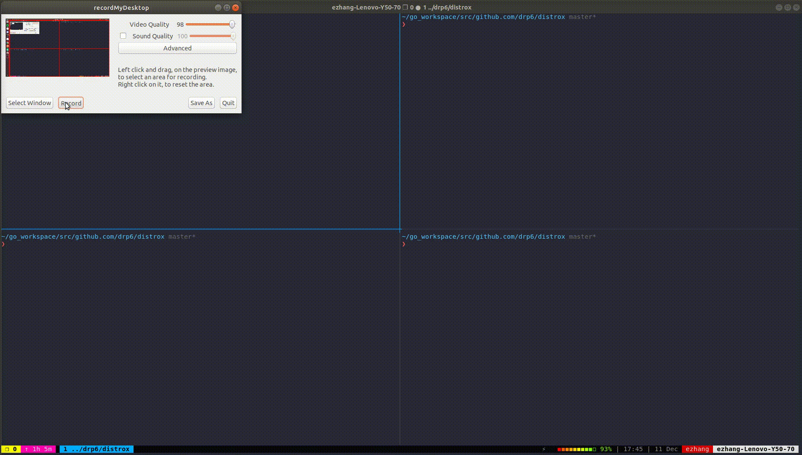

# Distrox

## What
Distrox is a simple distributed HTTP proxy server. It currently supports caching, leader election, load balancing, and firewalls.

## Usage

Ensure that [golang](https://golang.org/dl/) is installed and setup correctly.

Run ```make``` to build. A binary (`distrox`) will be generated.

Usage:
``` ./distrox [host] [port] [is_leader] ```

Example:
``` ./distrox localhost 8081 true ```

To connect one node to another node, type:
``` connect [host]:[port] ``` in the console while the node is running.


## Demo

  The first gif shows nodes joining/dying + the leader election process. The second gif shows a complete demo.

  <p align="center">
    
  </p>
  
  <p align="center">
    
  </p>
